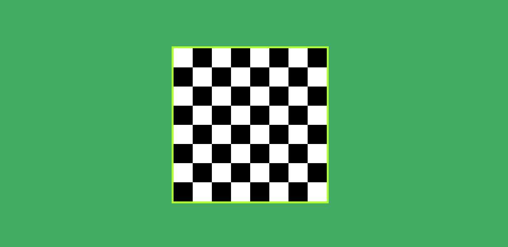

<kbd>

</kbd>
 
<h1>Tabuleiro de xadrez (pseudo-classes)</h1>

Antes de começar você precisará ter instalado em sua máquina o seguite:

<ul>
    <a href="https://git-scm.com">Git: https://git-scm.com</a>
     
    <a href="https://marketplace.visualstudio.com/items?itemName=ritwickdey.live-sass">Um compilador sass: https://marketplace.visualstudio.com/items?itemName=ritwickdey.live-sass</a>    
     
</ul>

Você também precisará de um editor de texto como o VSCode o compilador acima é pra ele.

### Rodando o Site

<ul>
    <li>Entre na pasta do projeto e abra o arquivo index.</li>
    <li>Seja feliz! O Sass ja esta compilado neste projeto :)</li>
    <li>Para novas alterações abra o arquivo sass e integre-o com o compilador.</li>
</ul>

### Tecnologias

As seguintes ferramentas foram usadas na construção do projeto:

<ul>
    <li>Html</li>
    <li>CSS</li>
    <li>Sass</li>
</ul>

### Autor

<a href="">
 
  
 <b>Carlos Eduardo</b></a>

Feito com ❤️ por Carlos Eduardo

<a href="mailto:carloseduardodiasbatista@gmail.com">Entre em contato</a>

